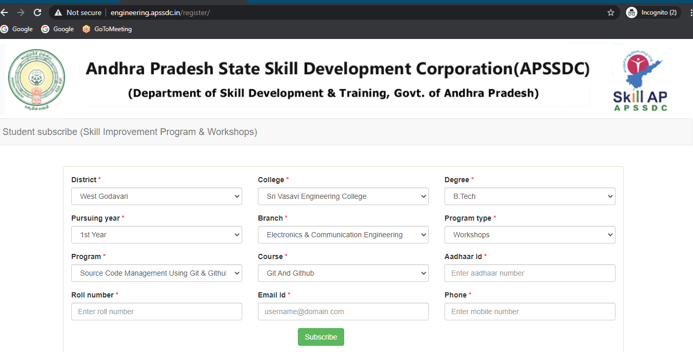

# APSSDC Registration Process

## Step 1

- open browser and visit www.engineering.apssdc.in/register you will navigate a page as shown below.

- Fill you college details horizontally as shown above like
  1. **District**
  2. **College**
  3. **Degree**
  4. **Pursing Year**
  5. **Branch**
  6. **Program Type:** Workshops
  7. **Program** As your trainer
  8. **Course** Based on Program automatically Course will be selected
  9. **Aadhar ID**
  10. **Roll Number**
  11. **Email ID**
  12. **Phone**

Then click on **Subscribe**

## Step 2

After clicking on Subscribe you will receive an email as shown below. Open that mail and click on **here** as shown below.

After clicking on **here** you will navigate to this below page fill all your details and click on **next**.

After filling clicking on **next **and you will navigate to this below Communication details page fill all your details and click on **next**.

After clicking on **next **and you will navigate to this below Education details page click on **Under Graduate ** if you are B. Tech and select **Post Graduate** if you are from M. Tech/MCA/MBA as show below and fill all your SSC/10th details and click on **Inter/ 12th/ Diploma**.

After clicking on  **Inter/ 12th/ Diploma** and you will navigate to this below tab fill all your details and click on **Graduation** link.

After clicking on **Graduation** and you will navigate to this below tab fill all your details and click on **Next**.

**Note:**

1. **Joining Date:** Your college joining data

2. **Graduation Date:** Your College ending date (mostly April 30 and Year of Graduation)

After clicking on **next **and you will navigate to this below Placement page. if you got any placement update those details.

After clicking on register you will get a popup window **success**

And for verification once repeat above **step-2** you will get a payment details then completed.
