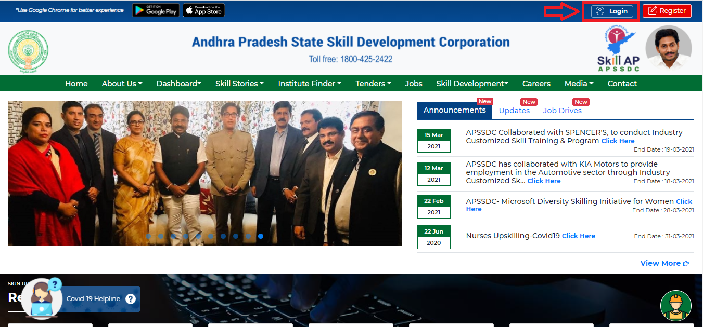

# SPOC Registration to the New Portal
## Step 1
open browser and visit **https://www.apssdc.in/home/** you will navigate a page as shown below.

Then click on **Login**
## Step 2

After clicking on LogIn you will get a Window as shown below.

Then click on **Forgot Password**

## Step 3
After clicking on **Forgot Password** you will navigate to this below page.

and Again click on **Click here** Option.

## Step 4
Then you will get this below image.

Fill all your details and click on **Validate**.

## step 5
After clicking on **Validate** you will get a Verification Mail to your mail ID and complete the process.
